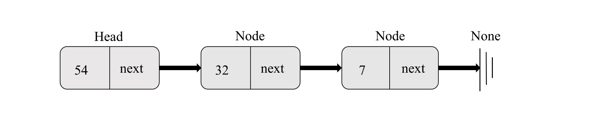

> ## What is a Linked List?
>
>  Linked list is a dynamic data structure where each element (node) is a separate object. 
>
>
> The basic building block for the linked list implementation is the node. Each node object must hold at least two pieces of information. First, the node must contain the list item itself. We will call this the data field of the node. In addition, each node must hold the address of the next node. The starting node of a linked list is referred to as the **head**.
> 
> 
>
>## Types of Linked Lists
>
> 1.   singly linked list          
> 2.   circular linked list 
> 3.   doubly linked list
> 
>  
>     