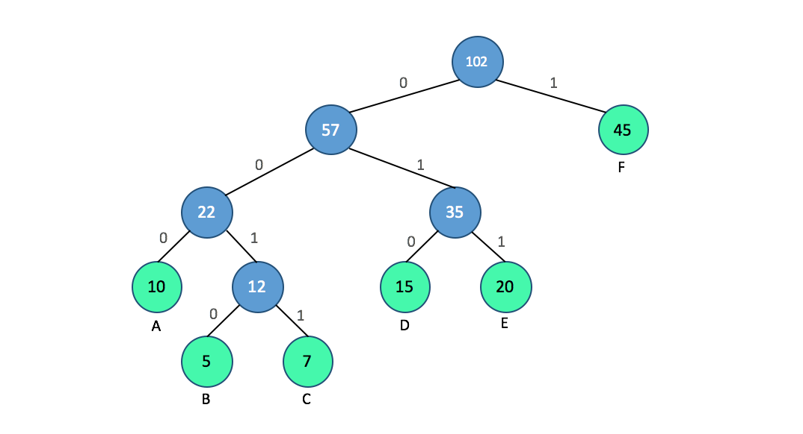

# Huffman Coding with Python
## Project Description
In this project, we will demonstrate how to compress and decompress a text file using Huffman coding. The project is divided into three main parts:

 1.  **Constructing Huffman code** ( [HuffmanCode.ipynb](https://github.com/ybruce61414/Data-Structures/blob/master/Tree/HuffmanCoding/HuffmanCode.ipynb)):
     * This part will show you how to build a **Huffman tree** from input characters, and generate Huffman codes by traversing the Huffman tree. 
 2.  **Encoding the file** ([main_encode.ipynb](https://github.com/ybruce61414/Data-Structures/blob/master/Tree/HuffmanCoding/main_encode.ipynb)):
      * This part will demonstrate how to encode the text into Huffman string, and save it as binary file in ASCII hex format. 
  
 3.  **Decoding the file** ([main_decode.ipynb](https://github.com/ybruce61414/Data-Structures/blob/master/Tree/HuffmanCoding/main_decode.ipynb)):
     * This part will demonstrate how to decode the binary file, and convert it into text data with Huffman code of each character.  
         

## What is Huffman coding?
Huffman coding is a lossless data compression algorithm. The idea is to assign variable-length codes to input characters, instead of fixed-length codes. Lengths of the assigned codes are based on the frequencies of corresponding characters. The most frequent character gets the smallest code, whereas the least frequent character gets the largest code.

Normally, each character in a text file is stored in eight bits using an encoding called ASCII. A Huffman-encoded file breaks down the rigid 8-bit structure so that the most commonly used characters are stored in just a few bits ('a' could be "10" or "1000" rather than the ASCII, which is "01100001").  However, the least common characters will take up more than 8 bits ('z' might be "00100011010") in some rare situations. Huffman encoding, on the whole, creates a much smaller file than the original one.

 ## How to generate Huffman code ?
 There are mainly two major parts in generating Huffman code:
 
1.  Build a Huffman tree from input characters.
2.  Traverse the Huffman tree and assign codes to characters.
 
 
 **Step for building a Huffman tree**
 
 - Count the frequency of each character.  
   ```python
   {'A':10, 'B':5, 'C':7, 'D':15, 'E':20, 'F':45}
   ``` 
 -  Extract two nodes with the minimum frequencies.
 -  Create a **parent node** with a frequency that is the sum of the extracted nodes' frequencies, and make the first extracted node as its **left child** and the other as its **right child**.
 - Do the above two steps successively until there is only one node which all others spring from, and which is the root of the tree.
 - The Huffman tree is complete.
 
 **Step for assigning codes from Huffman Tree**
 
 - Traverse the tree to reach each leaf node(character) from the root.
 - Append a **0** for each time you take the **left branch**, and a **1** for each time you take the **right branch**. Print the code word when a leaf node is encountered.
 - Obtain the Huffman code.
    ```python
   {'A':'000', 'B':'0010', 'C':'0011', 'D':'010', 'E':'011', 'F':'1'}
   ``` 

 
 
 
 
 
 
 
 